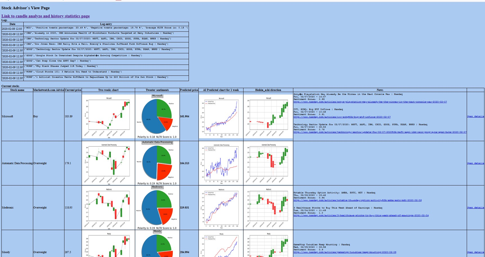
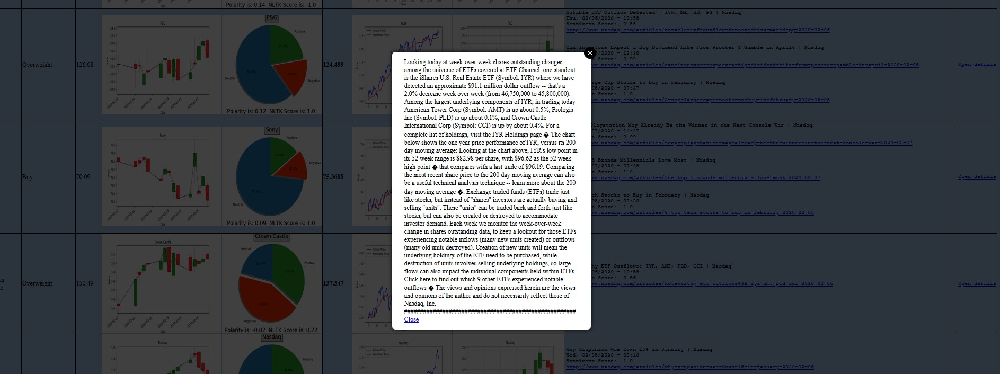
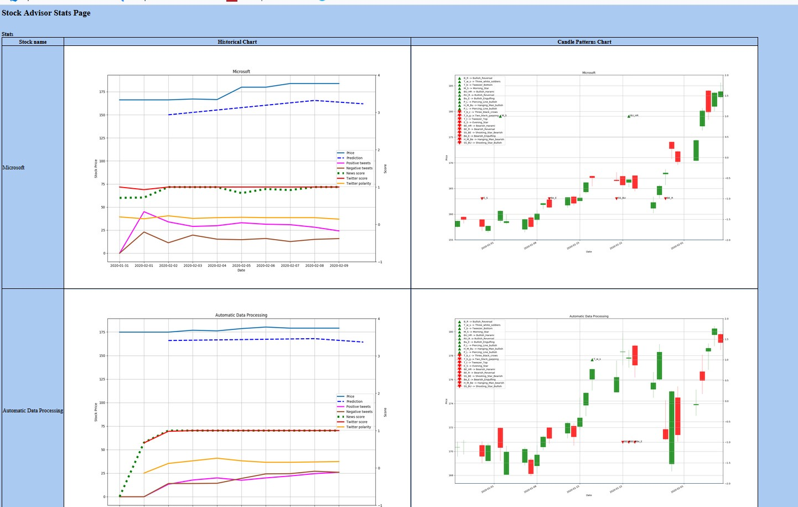
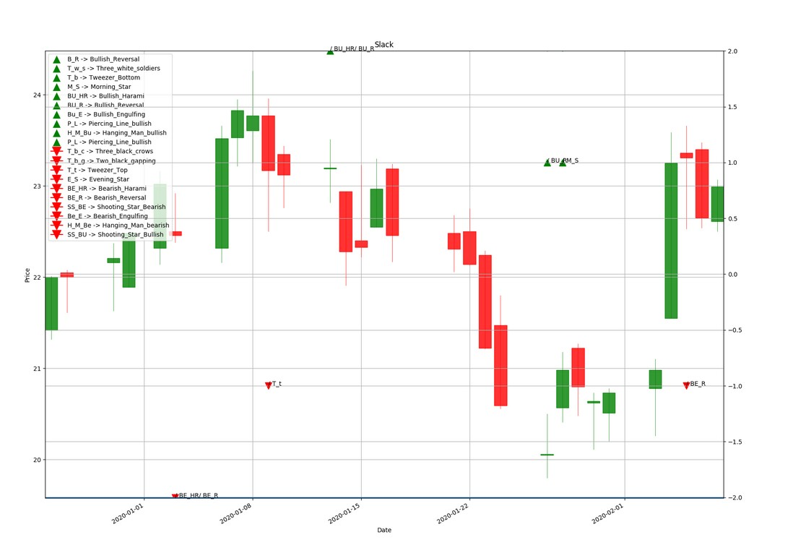
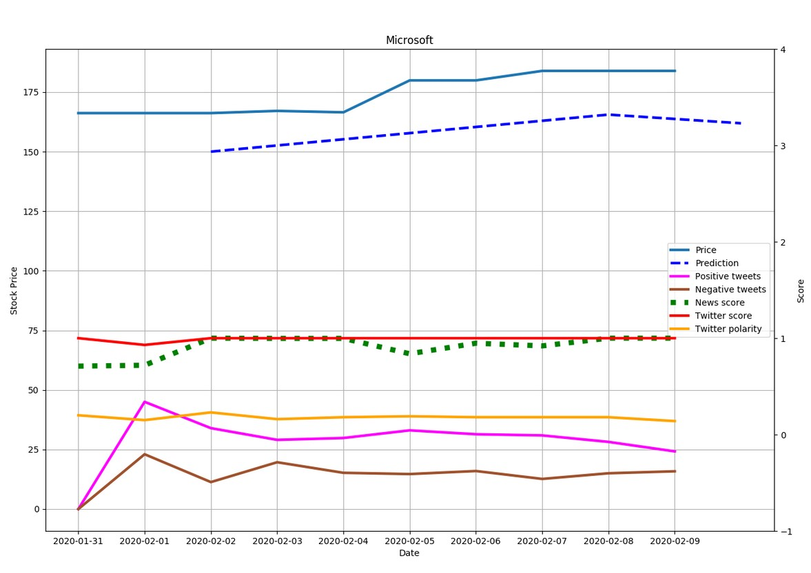

# Project for Stock-advising software. 
Software grabs price from Yahoo Finance, generates Heikin Ashi indicators, generates candle stick patterns, predicts price via tensorflow machine learning, scrabe news from Nasdaq.com and makes sentiment analysis via TextBlob, grabs tweets and make sentiment analysis via TextBlob and NLTK. All tools generates charts via Matplotlib. All results are written to history table for future review and tuning. 
This is frontpage:

If we press "Open details" then we can read clear text of news:

Next we can check Statistics page:

On this page we have the chart for Candlestick patterns and signals

And history of all signals for future analyze

